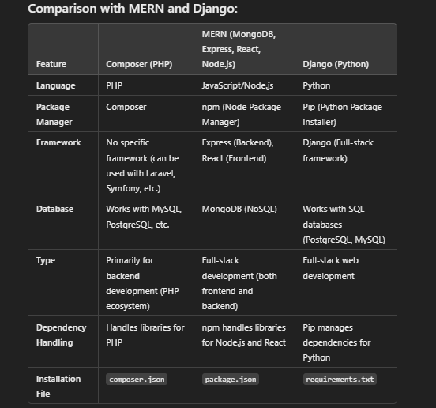

-composer 
is a package management too in php 
help manages libraries by installling and upadating them

Make laravel App 

composer create-project laravel/laravel example-app

composer global require laravel/installer
 
laravel new example-app

php artisan serve
php artisan make:controller UserController

